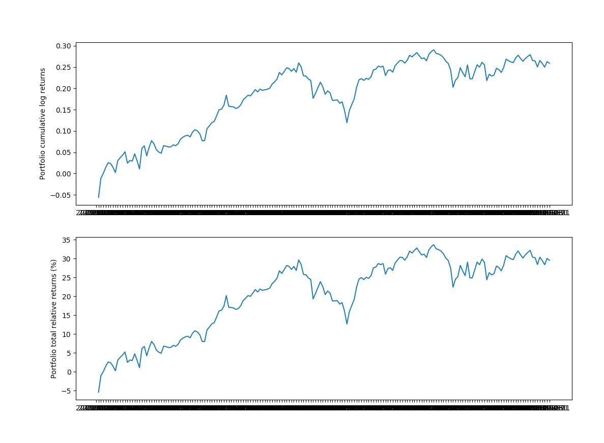

# Python with Google Finance API, pandas & matplotlib

### Setting up Google Finance API
Investors Exchange (IEX) at https://iexcloud.io/ offers a free web-based API to access financial data such as historical and current stock ticker information. You will need to setup an account (which requires an email validation) in order to obtain an API Key which we will use in our Python code. 

### Python Requirements
You will need to have installed the following Python packages (which you should probably already have):
* pandas
* pandas-datareader (this one does not come pre-installed with Anaconda)
* matplotlib

### Introduction to Pandas

https://pandas.pydata.org/pandas-docs/stable/getting_started/10min.html

### Introduction to Matplotlib

https://matplotlib.org/3.1.1/tutorials/introductory/pyplot.html

## Access and plot stock ticker data
First, import the following packages:

```
from pandas import Series, DataFrame
from pandas_datareader import data
import matplotlib.pyplot as plt
import numpy as np
import pandas as pd
import os
```

 Then we will set our IEX API KEY to the environment variable "IEX_API_KEY". **Note - you usually don't do this in your front end code**

```
os.environ["IEX_API_KEY"] = "pk_acd84b8074134c629bf5db6990c67a38"
```

Now, let's create a small list of tickers that we want to analyze. We can scale up with more stocks but we will start with just 3 for now. Let's also look at data for just this year. 

```
tickers = ['AAPL', 'AMZN', 'MSFT']

start_date = '2019-01-01'
end_date = '2019-10-01'
```

Now pull in the ticker data with pandas's `datareader` with:
```
stock_data = data.DataReader(tickers, 'iex', start_date, end_date)
```

Q) What's the data type of `stock_data`?
A) Pandas DataFrame -> `type(stock_data)`

Now let's have a look at our `stock_data` by either printing out the variable to the Terminal or querying it in the Python console:

` >>> stock_data`

We see we have daily information of the `open`, `high`, `low`, `close`, and `volume` of our selected tickers in each row. 

The index of each row is the date so you can access the first row with `stock_data.loc['2019-01-02']`
* Recall that with dataframes you use `.loc` to access a row index.

Let's plot just the stock price at close for each of our 3 tickers. We will use Python's powerful `matplotlib` library for creating subplots. For more details, see https://matplotlib.org/3.1.1/api/_as_gen/matplotlib.pyplot.subplots.html#matplotlib.pyplot.subplots

First, create the `close_data` object:
```
close_data = stock_data['close']
```
Let's have a quick look at the data with: `close_data.describe()`

And then plot:

```
# Plot of closing price data
fig, ax = plt.subplots(figsize=(16,9))
ax.plot(close_data.index, close_data['AAPL'], label='AAPL')
ax.plot(close_data.index, close_data['AMZN'], label='AMZN')
ax.plot(close_data.index, close_data['MSFT'], label='MSFT')
```

Now just label the axis and display the plot:
```
ax.set_xlabel('Date')
ax.set_ylabel('Closing price ($)')
ax.legend()
plt.show()
```


Good work! Now, if we want to look at price trends, the daily closing price will be quite noisy. So, another valuable series to look at is the simple moving average of the stock time-series data over a short and long window. The moving average is just the rolling average of the past X prices and pandas has a built-in `rolling()` function. For the short window, we will use 20 days and for the long window, 100 days. 

Note: creating a moving average means that for a window of $X$ units, the **first $X-1$** units are not valid. For example, if $X = 20\ days$, the data of the first 19 days is used to calculated the average for day 20. Day 21 is calculated using the prices from Day 2 to Day 21. 

The reason for introducing this concept of moving averages is that there are trading strategies based on the behaviour of moving averages of differet windows. 

We will just do this for one of the ticker's. Let's go with `AMZN`:

First, select the close ticker data for just Amazon
```
amzn = close_data.loc[:, 'AMZN']
```

> Then create the moving average series with:
```
short_rolling_amzn = amzn.rolling(window=20).mean()
long_rolling_amzn = amzn.rolling(window=100).mean()
```

> Now, similar to the steps we went through before, plot the AMZN close price, the 20day and the 100day rolling average Series. First, we need to clear the plot:

```
# Plot of moving averages
fig, ax = plt.subplots(figsize=(16,9))
ax.plot(amzn.index, amzn, label='AMZN')
ax.plot(short_rolling_amzn.index, short_rolling_amzn, label='20 days rolling')
ax.plot(long_rolling_amzn.index, long_rolling_amzn, label='100 days rolling')

ax.set_xlabel('Date')
ax.set_ylabel('Adjusted closing price ($)')
ax.set_title('Moving average of some tech stocks')
ax.legend()
plt.show()
```


Your turn to explore:
* Use a start date beginning in 2000 and compare the price trends of each of these 3 stocks.

* Calculate and plot the 50 day and 200 day moving averages. Which short term (20 or 50 days) and which long term (100 or 200 days) do you find better tracks the price trend?

For an interesting read on which moving average lines are popular and why, check out: https://www.investopedia.com/ask/answers/122414/what-are-most-common-periods-used-creating-moving-average-ma-lines.asp

Now let's take a look at a few simple but realistic quantitative trading strategies using Python pandas and the methods used above.

# Quantitative Trading Strategies

## Quantifying Returns
When we work with timeseries data in finance, we commonly define returns as the gain in price over a period of time defined as a percentage. So I can look at AMZN stock price over the course of the year and say the return is Y.

However, a more detailed approach is looking at the rate of change or price over a unit interval (such as a day or hour or even minute). Let's think of it per day since that's the interval of our current data.

We have the **relative return**:

$$
relative \_return(t) = \frac{p(t) - p(t-1)} {p(t-1)}
$$
which is simply the return between an incremental period of time.

And we have the **log-return**:
$$
log \_return(t) = log(\frac{p(t)} {p(t-1)})
$$

There are several reasons why log-returns are being used in the industry and some of them are related to long-standing assumptions about the behaviour of asset returns and are out of our scope. However, what we need to point out are two quite interesting properties: 
1. *Log-returns* are additive and this makes it easy to sum up time-series data:

    >  $r(t_1) + r(t_2) = log(\frac {p(t_1)} {p(t_0)}) + log(\frac {p(t_2)} {p(t_1)}) = log(\frac {p(t_2)} {p(t_0)}) $

    However *relative returns* are not additive. But most people understand relative returns.

    > $r(t_1) + r(t_2) = \frac{p(t_1) - p(t_0)} {p(t_0)} + \frac{p(t_2) - p(t_1)} {p(t_1)} \not = \frac{p(t_2) - p(t_0)} {p(t_0)}$ 

2. *Log-returns* **approximately equal** *relative returns* for values of $\frac {p(t)} {p(t-1)}$ close to 1. 


These can both be calculated easily with pandas:

```
relative_returns = close_data.pct_change(1)
relative_returns.head()

log_returns = np.log(close_data).diff()
log_returns.head()
```

Since we can add the incremental returns of the logs, the cumulative log returns are:

$$
c(t) = \Sigma_{k=1}^t r(t) 
$$

And converting between log-return and relative-return is simply:

$$
c_{relative}(t) = e^{c(t)} - 1
$$

So let us plot both the relative and log returns:
```
# Plot relative and log returns
fig, (ax1, ax2) = plt.subplots(2, 1, figsize=(16,12))

for c in log_returns:
    ax1.plot(log_returns.index, log_returns[c].cumsum(), label=str(c))

ax1.set_ylabel('Cumulative log returns')
ax1.legend(loc='best')

for c in relative_returns:
    ax2.plot(relative_returns.index, 100*(np.exp(log_returns[c].cumsum()) - 1), label=str(c))

ax2.set_ylabel('Total relative returns (%)')
ax2.legend(loc='best')
plt.show()
```
The plot should look something like this:


While in 2019, we don't see much variance in the two plots, if we zoom out since 2000, we can see why the log plot is more meaningful to address the scale:


## Defining a Trading Strategy
In defining a trading strategy, we want to derive a set of weights which we will apply to different assets in our portfolio and compare returns over a period of time. So given a certain amount of dollars $N$ we want to figure out $w_1(t)$ and $w_2(t)$ where the sum of those two is less than or equal to 1. 

For example, assume we can invest in 2 instruments only and that $N=\$1000$. If at some point $w_1(t)=0.4$ and $w_2(t)=0.6$, this means that we have invested $w_1(t)N=\$400$ in asset 1 and $w_2(t)N=\$600$ in asset 2. 

Note - We won't go into short selling here but you can also have negative weights representing short positions. 

Let us look at how to calculate the return of our trading strategy for **a single day**:

First, let us take the last day of our *log_returns* and make it a *column vector*:
```
r_t = log_returns.tail(1).transpose()
```

Then let us create equal weights for all 3 stocks (i.e. a weighting of $1/3$):
```
weights_vector = pd.DataFrame(1 / 3, index=r_t.index, columns=r_t.columns)
```
Finally we compute the matrix multipication, or *dot product* between the two matricies:
```
portfolio_log_return = weights_vector.transpose().dot(r_t)
>>> portfolio_log_return

date
2019-10-01   -0.003861
```
So this is the portfolio return on a single day using our $1/3$ weighting strategy for the 3 specific stocks we have picked. 

Now, let us do this for the entire period between our start and end dates:

```
weights_matrix = pd.DataFrame(1 / 3, index=close_data.index, columns=close_data.columns)

temp_var = weights_matrix.dot(log_returns.transpose())
temp_var.head().iloc[:, 0:5]
```
What we want is just the diagonal, which represents the daily cumulative return of our portfolio. We can use `np.diag(<matrix>)` to extract the diagonal of a matrix. 
```
portfolio_log_returns = pd.Series(np.diag(temp_var), index=log_returns.index)

>>> portfolio_log_returns.tail()
date
2019-09-25    0.014936
2019-09-26   -0.006708
2019-09-27   -0.008746
2019-09-30    0.012900
2019-10-01   -0.003861
dtype: float64
```
And the total relative returns are:
```
total_relative_returns = (np.exp(portfolio_log_returns.cumsum()) - 1)
```
Let us plot the results:

```
# Plot weighted relative and log returns
fig, (ax1, ax2) = plt.subplots(2, 1, figsize=(16,12))

ax1.plot(portfolio_log_returns.index, portfolio_log_returns.cumsum())
ax1.set_ylabel('Portfolio cumulative log returns')

ax2.plot(total_relative_returns.index, 100 * total_relative_returns)
ax2.set_ylabel('Portfolio total relative returns (%)')

plt.show()
```


This tells us that our portfolio return is about 30% between our start and end dates using our equal-split trading strategy over 3 stock assets. 

Let us quickly calculate our portfolio's average annual return:
```
days_per_year = 52 * 5
total_days_in_simulation = close_data.shape[0]
number_of_years = total_days_in_simulation / days_per_year

total_portfolio_return = total_relative_returns[-1]
average_yearly_return = (1 + total_portfolio_return)**(1 / number_of_years) - 1

print('Total portfolio return is: ' +
      '{:5.2f}'.format(100 * total_portfolio_return) + '%')

>>> Total portfolio return is: 29.54%

print('Average yearly return is: ' +
      '{:5.2f}'.format(100 * average_yearly_return) + '%')

>>> Average yearly return is: 42.77%
```

Your turn to explore:
* Go back to 2015 and calculate the total portfolio and average yearly returns since then. How about since 2010?

* How do these returns compare with the S&P 500 index over the same period? Use of the of S&P 500 ETF's such as 'IVV' or 'VOO'. **Note: data for some of these ETFs is not provided beyond 5 years**

So this was a demonstration of a pretty simple 'buy-and-hold' strategy with an equal split between the assets. In the next session, we look at a more complicated **moving average** trading strategy incorporating the moving average calculations we used earlier. 

## Moving Average Trading Strategy

Here, we look at using past price behaviours to develop a trading strategy. This will include using non-constant weights $w_i(t)$ and adapting them based on recent behaviour of the price of the assets. 

We will use the same 3 assets as we did in the previous sections along with their daily closing price:
```
tickers = ['AAPL', 'AMZN', 'MSFT']
close_data = stock_data['close']
```

One of the oldest and simplest trading strategies that exist is the one that uses a moving average of the price (or returns) timeseries to proxy the recent trend of the price. This helps remove the daily price 'noise' and allows us to observe the longer-term behaviour of the asset. 

Earlier, we created short-term and long-term moving averages for just the AMZN ticker:

```
amzn = close_data.loc[:, 'AMZN']

short_rolling_amzn = amzn.rolling(window=20).mean()
long_rolling_amzn = amzn.rolling(window=100).mean()
```
Plotting this again:

```
# Plot relative and log returns
fig, ax = plt.subplots(figsize=(16,9))
ax.plot(amzn.index, amzn, label='AMZN')
ax.plot(short_rolling_amzn.index, short_rolling_amzn, label='20 days rolling')
ax.plot(long_rolling_amzn.index, long_rolling_amzn, label='100 days rolling')

ax.set_xlabel('Date')
ax.set_ylabel('Adjusted closing price ($)')
ax.set_title('Moving average of some tech stocks')
ax.legend()
plt.show()
```


The Simple Moving Average (SMA) timeseries are less noisy but lag the original price timeseries, which means changes in the trend are only seen with a delay (or lag) of some number of days - let's call this $L$. For a moving average calculated using $M$ days, the lag $L$ is roughly $\frac M 2$. 

So if we are using a 100 days SMA, this means we may be late by almost 50 days, which can significantly affect our strategy.

One way to reduce the lag induced by the use of the SMA is to use the so-called **Exponential Moving Average (EMA)**, defined as:

>$ EMA(t) = (1-\alpha)EMA(t-1) + \alpha p(t)$

with a starting condition:

>$EMA(t_0) = p(t_0)$

where $p(t)$ is the price at time $t$ and $\alpha$ is called the *decay parameter* for the $EMA$. 

$\alpha$ is related to the window $M$ as:

>$ \alpha = \frac 2 {M+1}$

So as $M$ gets larger, $\alpha$ gets smaller. The reason why EMA reduces the lag is that it puts more weight on more recent observations, whereas the SMA weights all observations equally by $\frac 1 M$.

So take $M_1$ = 20 days, $M_2$ = 100 days, $t_0$ = yesterday and $t_1$ = today. 

With $M_1$ = 20 days:

> $EMA(t_1) = 0.905EMA(t_0) + 0.095p(t_1)$


With $M_1$ = 100 days:

> $EMA(t_1) = 0.98EMA(t_0) + 0.02p(t_1)$

The weighting given to the most recent price $p(t_1)$ is greater for a shorter-period EMA ($0.095$) than for a longer-period EMA ($0.02$) and both weightings are higher than what the SMA would have used:

$M_1$ = 20 days:

EMA weighting on $p(t_1)$: $0.095$
SMA weighting on $p(t_1)$: $0.05$

$M_1$ = 100 days:

EMA weighting on $p(t_1)$: $0.02$
SMA weighting on $p(t_1)$: $0.01$

Using Pandas, calculating the exponential moving average is easy. Let's compare the 20 day SMA vs EMA:
```
ema_amzn_short = amzn.ewm(span=20, adjust=False).mean()

# Plot EMA and SMA
fig, ax = plt.subplots(figsize=(16,9))
ax.plot(amzn.index, amzn, label='AMZN Price')
ax.plot(short_rolling_amzn.index, short_rolling_amzn, label='20 days SMA')
ax.plot(ema_amzn_short.index, ema_amzn_short, label='20 days EMA')

ax.set_xlabel('Date')
ax.set_ylabel('Price ($)')
ax.legend()
plt.show()
```


Note the EMA curve smooths out the price fluctuations just like the SMA curve, but is more responsive to price trend changes.

### MA Strategy 1

Here, we are going to take advantage of the fact that a moving average timeseries (whether SMA or EMA) lags the actual price behaviour. Our strategy will be to use the crossing of the moving average an actual price timeseries as potential trading signals:

1. When the price timeseries $p(t)$ crosses the EMA timeseries $e(t)$ from below, we will buy (go long) one unit of the asset.

2. When the price timeseries $p(t)$ crosses the EMA timeseries $e(t)$ from above, we will sell one unit of the asset.

Like the last exercise, we will assume our funds are equally split across all 3 assets with a weighting of $w_i(t) = \frac 1 3$ when we are holding the asset and a weighting of $w_i(t) = 0$ when we have sold the asset.

*Advanced - if you are familiar with the concept of short selling, you can use a weighting of $w_i(t) = -\frac 1 3$ in your strategy.*

So to implement the above strategy in Python using Pandas, we simply take the *sign** of the difference between the price $p_i(t)$ and the EMA $e_i(t)$:

```
ema_short = close_data.ewm(span=20, adjust=False).mean()

trading_positions_raw = close_data - ema_short

trading_positions = trading_positions_raw

trading_positions_raw[trading_positions_raw <= 0] = 0

trading_positions = trading_positions_raw.apply(np.sign)*1/3
```
This gives us a `trading_positions` dataframe which looks like:


where $0$ represents days we are not holding the particular stock, and the $0.33..$ representing days we are holding the particular stock. 

Now note that because we are using the **closing stock price** in our analysis, determining whether we are holding a stock or not impacts our action on the **following day**. So our position on $t_0$ is determined by the closing price on day $t_0 - 1$. So this means we need to **lag our trading signals by one day:**

```
trading_positions_final = trading_positions.shift(1)
```
So let us plot the price timeseries and the respective trading position for one of our assets, Amazon:

```
fig, (ax1, ax2) = plt.subplots(2, 1, figsize=(16,9))

ax1.plot(close_data.loc[start_date:end_date, :].index, close_data.loc[start_date:end_date, 'AMZN'], label='Price')
ax1.plot(ema_short.loc[start_date:end_date, :].index, ema_short.loc[start_date:end_date, 'AMZN'], label = 'Span 20-days EMA')

ax1.set_ylabel('$')

ax2.plot(trading_positions_final.loc[start_date:end_date, :].index, trading_positions_final.loc[start_date:end_date, 'AMZN'], label='Trading position')

ax2.set_ylabel('Trading position')
```

And so we get a plot looking something like this:


So we can see how well our 20 day EMA tracks the price as well as when we are holding the stock. 

Now that the position our strategy dictates each day has been calculated the performance of this strategy can be easily estimated. To that end, we will need again the log-returns of the three assets $r_i(t)$ calculated as the difference between the log of the price each day:

```
asset_log_returns = np.log(close_data).diff()
```
Note our strategy assumes each asset is traded separately and is independent of the behaviour of the other assets. However, this might not necessarily be true (e.g. poor earnings news from AMZN might impact other tech stocks like AAPL or MSFT). 

So as before, to get all the strategy log-returns for all days, simply multiply the strategy positions matrix `trading_positions_final` with the `asset_log_returns`:

```
strategy_asset_log_returns = trading_positions_final * asset_log_returns
```
And as before, let us plot the cumulative log-returns and relative-returns of our strategy for each of the 3 assets:

```
# For logs, it is a straight sum
cum_strategy_asset_log_returns = strategy_asset_log_returns.cumsum()

# For relative returns, we use the formulat as before
cum_strategy_asset_relative_returns = np.exp(cum_strategy_asset_log_returns) - 1

# Now we plot
fig, (ax1, ax2) = plt.subplots(2, 1, figsize=(16,9))

for c in asset_log_returns:
    ax1.plot(cum_strategy_asset_log_returns.index, cum_strategy_asset_log_returns[c], label=str(c))

ax1.set_ylabel('Cumulative log-returns')
ax1.legend(loc='best')

for c in asset_log_returns:
    ax2.plot(cum_strategy_asset_relative_returns.index, 100*cum_strategy_asset_relative_returns[c], label=str(c))

ax2.set_ylabel('Total relative returns (%)')
ax2.legend(loc='best')
```
And we get plots which look like:


What is the **total return** of this strategy? We simply sum up the daily returns for each of the 3 assets:

```
cum_relative_return = cum_strategy_asset_relative_returns.sum(axis=1)


fig, ax = plt.subplots(figsize=(16,9))

ax.plot(cum_relative_return.index, 100*cum_relative_return, label='Returns')

ax.set_ylabel('Total cumulative relative returns (%)')
ax.legend(loc='best')
```


And the overall, yearly, performance of our strategy can be calculated again as (this time we write it as a function):

```
def print_portfolio_yearly_statistics(portfolio_cumulative_relative_returns, days_per_year = 52 * 5):

    total_days_in_simulation = portfolio_cumulative_relative_returns.shape[0]
    number_of_years = total_days_in_simulation / days_per_year

    # The last data point will give us the total portfolio return
    total_portfolio_return = portfolio_cumulative_relative_returns[-1]
    # Average portfolio return assuming compunding of returns
    average_yearly_return = (1 + total_portfolio_return)**(1/number_of_years) - 1

    print('Total portfolio return is: ' + '{:5.2f}'.format(100*total_portfolio_return) + '%')
    print('Average yearly return is: ' + '{:5.2f}'.format(100*average_yearly_return) + '%')

print_portfolio_yearly_statistics(cum_relative_return)

>>> Total portfolio return is: 14.99%
    Average yearly return is: 21.18%
```
Recall that the returns from our 'Buy-and-Hold' strategy was:
```
>>> Total portfolio return is: 29.54%
>>> Average yearly return is: 42.77%
```
So our 20 day Moving Average Trading strategy signficantly underperforms the buy-and-hold for **this specific set of assets** over our **specific period of time**. 

Your turn to explore:

*  How do the 2 strategies compare at different points in time if you were to go back say 2 years? 5 years? 10 years?

* How does a longer term Moving Average Trading strategy (e.g. 100 or 200 days) compare with the 20 day strategy?

* What if we diversify our portfolio of assets and use stocks from different industries? What do our returns look like then?
