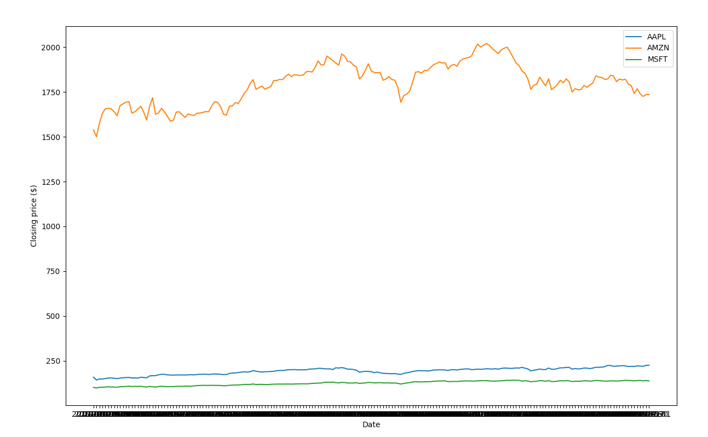

# Python with Google Finance API, Pandas & Matplotlib
This workshop is an adaptation of the posts by Gerogios Efstathopoulos and can be found here: https://www.learndatasci.com/tutorials/python-finance-part-yahoo-finance-api-pandas-matplotlib/

### Setting up Google Finance API
Investors Exchange (IEX) at https://iexcloud.io/ offers a free web-based API to access financial data such as historical and current stock ticker information. You will need to setup an account (which requires an email validation) in order to obtain an API Key which we will use in our Python code. 

### Python Requirements
You will need to have installed the following Python packages (which you should probably already have):
* pandas
* pandas-datareader (this one does not come pre-installed with Anaconda)
* matplotlib

### Introduction to Pandas

https://pandas.pydata.org/pandas-docs/stable/getting_started/10min.html

### Introduction to Matplotlib

https://matplotlib.org/3.1.1/tutorials/introductory/pyplot.html

## Access and plot stock ticker data
First, import the following packages:

```
from pandas import Series, DataFrame
from pandas_datareader import data
import matplotlib.pyplot as plt
import numpy as np
import pandas as pd
import os
```

 Then we will set our IEX API KEY to the environment variable "IEX_API_KEY". **Note - you usually don't do this in your front end code**

```
os.environ["IEX_API_KEY"] = "pk_acd84b8074134c629bf5db6990c67a38"
```

Now, let's create a small list of tickers that we want to analyze. We can scale up with more stocks but we will start with just 3 for now. Let's also look at data for just this year. 

```
tickers = ['AAPL', 'AMZN', 'MSFT']

start_date = '2019-01-01'
end_date = '2019-10-01'
```

Now pull in the ticker data with pandas's `datareader` with:
```
stock_data = data.DataReader(tickers, 'iex', start_date, end_date)
```

Q) What's the data type of `stock_data`?
A) Pandas DataFrame -> `type(stock_data)`

Now let's have a look at our `stock_data` by either printing out the variable to the Terminal or querying it in the Python console:

` >>> stock_data`

We see we have daily information of the `open`, `high`, `low`, `close`, and `volume` of our selected tickers in each row. 

The index of each row is the date so you can access the first row with `stock_data.loc['2019-01-02']`
* Recall that with dataframes you use `.loc` to access a row index.

Let's plot just the stock price at close for each of our 3 tickers. We will use Python's powerful `matplotlib` library for creating subplots. For more details, see https://matplotlib.org/3.1.1/api/_as_gen/matplotlib.pyplot.subplots.html#matplotlib.pyplot.subplots

First, create the `close_data` object:
```
close_data = stock_data['close']
```
Let's have a quick look at the data with: `close_data.describe()`

And then plot:

```
# Plot of closing price data
fig, ax = plt.subplots(figsize=(16,9))
ax.plot(close_data.index, close_data['AAPL'], label='AAPL')
ax.plot(close_data.index, close_data['AMZN'], label='AMZN')
ax.plot(close_data.index, close_data['MSFT'], label='MSFT')
```

Now just label the axis and display the plot:
```
ax.set_xlabel('Date')
ax.set_ylabel('Closing price ($)')
ax.legend()
plt.show()
```



Good work! Now, if we want to look at price trends, the daily closing price will be quite noisy. So, another valuable series to look at is the simple moving average of the stock time-series data over a short and long window. The moving average is just the rolling average of the past X prices and pandas has a built-in `rolling()` function. For the short window, we will use 20 days and for the long window, 100 days. 

Note: creating a moving average means that for a window of $X$ units, the **first $X-1$** units are not valid. For example, if $X = 20\ days$, the data of the first 19 days is used to calculated the average for day 20. Day 21 is calculated using the prices from Day 2 to Day 21. 

The reason for introducing this concept of moving averages is that there are trading strategies based on the behaviour of moving averages of differet windows. 

We will just do this for one of the ticker's. Let's go with `AMZN`:

First, select the close ticker data for just Amazon
```
amzn = close_data.loc[:, 'AMZN']
```

> Then create the moving average series with:
```
short_rolling_amzn = amzn.rolling(window=20).mean()
long_rolling_amzn = amzn.rolling(window=100).mean()
```

> Now, similar to the steps we went through before, plot the AMZN close price, the 20day and the 100day rolling average Series. First, we need to clear the plot:

```
# Plot of moving averages
fig, ax = plt.subplots(figsize=(16,9))
ax.plot(amzn.index, amzn, label='AMZN')
ax.plot(short_rolling_amzn.index, short_rolling_amzn, label='20 days rolling')
ax.plot(long_rolling_amzn.index, long_rolling_amzn, label='100 days rolling')

ax.set_xlabel('Date')
ax.set_ylabel('Adjusted closing price ($)')
ax.set_title('Moving average of some tech stocks')
ax.legend()
plt.show()
```


Your turn to explore:
* Use a start date beginning in 2000 and compare the price trends of each of these 3 stocks.

* Calculate and plot the 50 day and 200 day moving averages. Which short term (20 or 50 days) and which long term (100 or 200 days) do you find better tracks the price trend?

For an interesting read on which moving average lines are popular and why, check out: https://www.investopedia.com/ask/answers/122414/what-are-most-common-periods-used-creating-moving-average-ma-lines.asp

Now let's take a look at a few simple but realistic quantitative trading strategies using Python pandas and the methods used above.