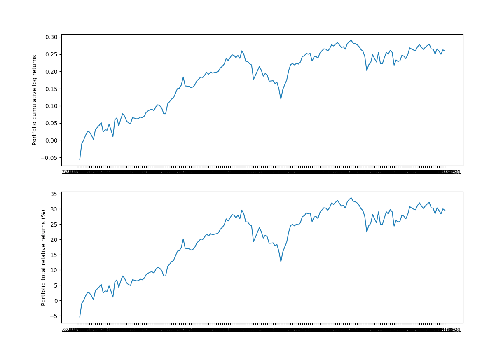

## Quantatitive Trading Strategies Part 2

In the last session, we looked at a basic trading strategy where we plot a series of moving averages, such as the 100 day and 20 day moving averages, and then compare where they intersect. We will expand on this approach and use pandas to calculate the return of our strategies. 

Just looking at the price information has some drawbacks. The price of a stock is only positive and so it gets messy if we use models and approaches which require or use negative numbers. Also, looking at price numbers over a long period of time results in statistical properties which are less stable. For example, consider the price curve of AMZN. The summary of its dataframe looks like:
```
count    1218.000000
mean     1093.214138
std       526.504130
min       286.950000
25%       659.612500
50%       957.985000
75%      1640.200000
max      2039.510000
Name: AMZN, dtype: float64
```
The standard deviation is huge!

An alternative approach is to look at the timeseries of the changes or delta in the price vs. the timeseries of the price itself. The most common timeseries used are:

We have the **relative return**:

$$
relative \_return(t) = \frac{p(t) - p(t-1)} {p(t-1)}
$$
which is simply the return between an incremental period of time.

And we have the **log-return**:
$$
log \_return(t) = log(\frac{p(t)} {p(t-1)})
$$

Why do we use the log-return timeseries?

Well say if we wanted to sum the returns over 5 intervals, will adding the relative returns over those 5 intervals give us the total return over the period? No - relative returns are not additive!

1. *Log-returns* are additive and this makes it easy to sum up time-series data:

    >  $r(t_1) + r(t_2) = log(\frac {p(t_1)} {p(t_0)}) + log(\frac {p(t_2)} {p(t_1)}) = log(\frac {p(t_2)} {p(t_0)}) $

    However *relative returns* are not additive. But most people understand relative returns.

    > $r(t_1) + r(t_2) = \frac{p(t_1) - p(t_0)} {p(t_0)} + \frac{p(t_2) - p(t_1)} {p(t_1)} \not = \frac{p(t_2) - p(t_0)} {p(t_0)}$ 

2. *Log-returns* **approximately equal** *relative returns* for values of $\frac {p(t)} {p(t-1)}$ close to 1. 

These can both be calculated easily with pandas:

```
relative_returns = close_data.pct_change(1)
relative_returns.head()

log_returns = np.log(close_data).diff()
log_returns.head()
```

> Create a `relative_returns` and `log-returns` timeseries for both MSFT and AMZN and plot them. 

Now how do we convert between these incremental returns to get the cumulative return?

Since we can add the incremental returns of the logs, the cumulative log returns are:

$$
c(t) = \Sigma_{k=1}^t r(t) 
$$

And converting between log-return and relative-return is simply:

$$
c_{relative}(t) = e^{c(t)} - 1
$$

So let us plot both the relative and log returns, first with one ticker:
```
log_returns_msft = log_returns['MSFT']
cumsum_log_returns_msft = log_returns_msft.cumsum()
cumsum_relative_returns_msft = np.exp(cumsum_log_returns_msft) - 1


# Plot relative and log returns for MSFT
fig, (ax1, ax2) = plt.subplots(2, 1, figsize=(16,12))

ax1.plot(cumsum_log_returns_msft.index, cumsum_log_returns_msft, label='MSFT')
ax1.set_ylabel('Cumulative log returns')
ax1.legend(loc='best')

ax2.plot(cumsum_relative_returns_msft.index, 100*(cumsum_relative_returns_msft), label='MSFT')
ax2.set_ylabel('Total relative returns (%)')
ax2.legend(loc='best')
plt.show()
```
```
# Plot relative and log returns for all tickers
fig, (ax1, ax2) = plt.subplots(2, 1, figsize=(16,12))

for c in log_returns:
    ax1.plot(log_returns.index, log_returns[c].cumsum(), label=str(c))

ax1.set_ylabel('Cumulative log returns')
ax1.legend(loc='best')

for c in relative_returns:
    ax2.plot(relative_returns.index, 100*(np.exp(log_returns[c].cumsum()) - 1), label=str(c))

ax2.set_ylabel('Total relative returns (%)')
ax2.legend(loc='best')
plt.show()
```

Great! Now we have the ability to dissect any stock price ticker into its daily/unit returns and then calculate the **cumulative** return over a defined time period!

## Defining a Trading Strategy
In defining a trading strategy, we want to derive a set of weights which we will apply to different assets in our portfolio and compare returns over a period of time. So given a certain amount of dollars $N$ we want to figure out $w_1(t)$ and $w_2(t)$ where the sum of those two is less than or equal to 1. 

For example, assume we can invest in 2 instruments only and that $N=\$1000$. If at some point $w_1(t)=0.4$ and $w_2(t)=0.6$, this means that we have invested $w_1(t)N=\$400$ in asset 1 and $w_2(t)N=\$600$ in asset 2. 

Note - We won't go into short selling here but you can also have negative weights representing short positions. 

### Single Day
Let us look at how to calculate the return of our trading strategy for **a single day**:

First, let us take the last day of our *log_returns* and make it a *column vector*:
```
last_day = log_returns.tail(1)
>>> last_day
Symbols         AMZN      MSFT       IXN       IYH
date                                              
2019-11-01  0.008285  0.002438  0.015083  0.003423
```

Then let us create equal weights for all 3 stocks (i.e. a weighting of $1/3$) using the same index and columns as our returns vector.
```
weights_vector = pd.DataFrame([[1/3, 1/3, 1/3]], index=last_day.index, columns=last_day.columns)
```
So what we want to do is multiply the weight of each stock times the return for that stock to determine how much we would actually get for a single day. In order to do this multiplication we simply do:. 

```
weights_vector*last_day

>>> Out[14]: 
Symbols         AMZN      MSFT       IXN       IYH
date                                              
2019-11-01  0.002762  0.000813  0.005028  0.001141
```
And if we want the sum across all stocks, just sum up all the columns (referred to as axis 1 - see https://pandas.pydata.org/pandas-docs/stable/reference/api/pandas.DataFrame.sum.html)

```
portfolio_daily_log_return = (weights_vector * log_returns).sum(axis=1)
>>> portfolio_daily_log_return

date
2019-11-01    0.009743
```
So this is the portfolio return on a single day, from the previous day, using our $1/3$ weighting strategy for the 3 specific stocks we have picked. 

Now, let us do this for the entire period between our start and end dates:

```
weights_matrix = pd.DataFrame([[1/3, 1/3, 1/3]], index=close_data.index, columns=close_data.columns)
portfolio_daily_log_returns = (weights_matrix * log_returns).sum(axis=1)
>>> portfolio_daily_log_returns.tail()
date
2019-10-28    0.018468
2019-10-29   -0.004928
2019-10-30    0.011353
2019-10-31   -0.005091
2019-11-01    0.009743
dtype: float64
```
The cumulative log-return timeseries is:
```
cumulative_log_returns = portfolio_daily_log_returns.cumsum()
```

And the total relative return is:
```
cumulative_relative_returns = (np.exp(cumulative_log_returns) - 1)
```

Let us plot the results:

```
# Plot weighted relative and log returns
fig, (ax1, ax2) = plt.subplots(2, 1, figsize=(16,12))

ax1.plot(cumulative_log_returns.index, cumulative_log_returns)
ax1.set_ylabel('Portfolio cumulative log returns')

ax2.plot(cumulative_relative_returns.index, 100 * cumulative_relative_returns)
ax2.set_ylabel('Portfolio cumulative relative returns (%)')

plt.show()
```


This tells us that our portfolio return is about 30% between our start and end dates using our equal-split trading strategy over 3 stock assets. 

Let us quickly calculate our portfolio's average annual return:
```
days_per_year = 52 * 5
total_days_in_simulation = close_data.shape[0]
number_of_years = total_days_in_simulation / days_per_year

total_portfolio_return = cumulative_relative_returns[-1] - 1
average_yearly_return = (1 + total_portfolio_return)**(1 / number_of_years) - 1

print('Total portfolio return is: ' +
      '{:5.2f}'.format(100 * total_portfolio_return) + '%')

>>> Total portfolio return is: 29.54%

print('Average yearly return is: ' +
      '{:5.2f}'.format(100 * average_yearly_return) + '%')

>>> Average yearly return is: 42.77%
```

Your turn to explore:

* How do these returns compare with the S&P 500 index over the same period? Use of the of S&P 500 ETF's such as 'IVV' or 'VOO'. **Note: data for some of these ETFs is not provided beyond 5 years**

So this was a demonstration of a pretty simple 'buy-and-hold' strategy with an equal split between the assets. In the next session, we look at a more complicated **moving average** trading strategy incorporating the moving average calculations we used earlier.

## Moving Average Trading Strategy

One of the oldest and simplest trading strategies that exist is the one that uses a moving average of the price (or returns) timeseries to proxy the recent trend of the price. This helps remove the daily price 'noise' and allows us to observe the longer-term behaviour of the asset. 

Earlier, we created short-term (20 day) and long-term (100 day) moving averages. 

Here, we are going to take advantage of the fact that a moving average timeseries lags the actual price behaviour. Our strategy will be to use the crossing of the moving average an actual price timeseries as potential trading signals:

1. When the price timeseries $p(t)$ crosses the MA timeseries $MA(t)$ from below, we will buy (go long) one unit of the asset.

2. When the price timeseries $p(t)$ crosses the MA timeseries $MA(t)$ from above, we will sell one unit of the asset.

Like the last exercise, we will assume our funds are equally split across all 3 assets with a weighting of $w_i(t) = \frac 1 3$ when we are holding the asset and a weighting of $w_i(t) = 0$ when we have sold and are not holding the asset.

*Advanced - if you are familiar with the concept of short selling, you can use a weighting of $w_i(t) = -\frac 1 3$ in your strategy.*

So to implement the above strategy in Python using Pandas, we simply take the *sign** of the difference between the price $p_i(t)$ and the $MA_i(t)$:

```
trading_positions_raw = close_data - short_rolling

trading_positions_raw[trading_positions_raw <= 0] = 0

trading_positions = trading_positions_raw.apply(np.sign)*1/3
>>> trading_positions

Symbols         AMZN      MSFT       IXN       IYH
date                                              
2015-01-02       NaN       NaN       NaN       NaN
2015-01-05       NaN       NaN       NaN       NaN
2015-01-06       NaN       NaN       NaN       NaN
2015-01-07       NaN       NaN       NaN       NaN
2015-01-08       NaN       NaN       NaN       NaN
             ...       ...       ...       ...
2019-10-28  0.333333  0.333333  0.333333  0.333333
2019-10-29  0.333333  0.333333  0.333333  0.333333
2019-10-30  0.333333  0.333333  0.333333  0.333333
2019-10-31  0.333333  0.333333  0.333333  0.333333
2019-11-01  0.333333  0.333333  0.333333  0.333333

[1218 rows x 4 columns]
```
Now note that because we are using the **closing stock price** in our analysis, determining whether we are holding a stock or not impacts our action on the **following day**. So our position on $t_0$ is determined by the closing price on day $t_0 - 1$. So this means we need to **lag our trading signals by one day:**

```
trading_positions_final = trading_positions.shift(1)
```
So let us plot the price timeseries and the respective trading position for one of our assets, Amazon:

```
fig, (ax1, ax2) = plt.subplots(2, 1, figsize=(16,9))

ax1.plot(close_data.index, close_data['AMZN'], label='Price')
ax1.plot(short_rolling.index, short_rolling['AMZN'], label = 'Span 20-days MA')
ax1.set_ylabel('$')

ax2.plot(trading_position_final.index, trading_position_final['AMZN'], label='Trading position')
ax2.set_ylabel('Trading position')

plt.show()
```

So we can see how well our 20 day EMA tracks the price as well as when we are holding the stock. 

Now that the position our strategy dictates each day has been calculated the performance of this strategy can be easily estimated. To that end, we will need again the log-returns of the three assets $r_i(t)$ calculated as the difference between the log of the price each day:

```
log_returns = np.log(close_data).diff()
```
Note our strategy assumes each asset is traded separately and is independent of the behaviour of the other assets. However, this might not necessarily be true (e.g. poor earnings news from AMZN might impact other tech stocks like AAPL or MSFT). 

So as before, to get all the strategy log-returns for all days, simply multiply the strategy positions matrix `trading_positions_final` with the `asset_log_returns`:

```
strategy_log_returns = (trading_positions_final * log_returns).sum(axis=1)
```
And as before, let us plot the cumulative log-returns and relative-returns of our strategy for each of the 3 assets:

```
# For logs, it is a straight sum
cumulative_strategy_log_returns = strategy_log_returns.cumsum()

# For relative returns, we use the formulat as before
cumulative_strategy_relative_returns = np.exp(cumulative_strategy_log_returns) - 1

# Plot weighted relative and log returns
fig, (ax1, ax2) = plt.subplots(2, 1, figsize=(16,12))

ax1.plot(cumulative_strategy_log_returns.index, cumulative_strategy_log_returns)
ax1.set_ylabel('Portfolio cumulative log returns')

ax2.plot(cumulative_strategy_relative_returns.index, 100 * cumulative_strategy_relative_returns)
ax2.set_ylabel('Strategy cumulative relative returns (%)')

plt.show()
```


And the overall, yearly, performance of our strategy can be calculated again as (this time we write it as a function):

```
days_per_year = 52 * 5
total_days_in_simulation = cumulative_strategy_relative_returns.shape[0]
number_of_years = total_days_in_simulation / days_per_year

total_portfolio_return = cumulative_strategy_relative_returns[-1] - 1
average_yearly_return = (1 + total_portfolio_return)**(1 / number_of_years) - 1

print('Total portfolio return is: ' +
      '{:5.2f}'.format(100 * total_portfolio_return) + '%')

>>> Total portfolio return is: X%

print('Average yearly return is: ' +
      '{:5.2f}'.format(100 * average_yearly_return) + '%')

>>> Average yearly return is: Y%
```

* So which strategy did better? The **buy-and-hold** or the **short moving average**?

Your turn to explore:

* Go through the Moving Average Trading Strategy exercise again, but this time with the following twist:
    1. First create a 50 day and 200 day moving averages

    2. In the previous exercise, we looked at price vs. 20 day moving average to come up with our trading positions. Now, we will look at the 50 day vs. 200 day moving average to come up with our trading positions. When the 50 day MA price > 200 day MA price, we buy and hold. When 50 day MA price < 200 day MA price, we sell and not hold. 

    3. Calculate the total and average yearly portfolio returns using this strategy.

Reference for this strategy: https://www.investopedia.com/ask/answers/122414/what-are-most-common-periods-used-creating-moving-average-ma-lines.asp

Quant competition:

* IAU - Gold Trust
* IXC - Global Energy
* IXG - Global Financials
* IXJ - Global Healthcare
* IXN - Global Tech

Come up with best weightings using at least 2 of these 5 ETFs

Using non-constant weights:
```
weights = pd.DataFrame([[1/3, 1/4, 5/12]], index=close_data.index, columns=close_data.columns)
```
