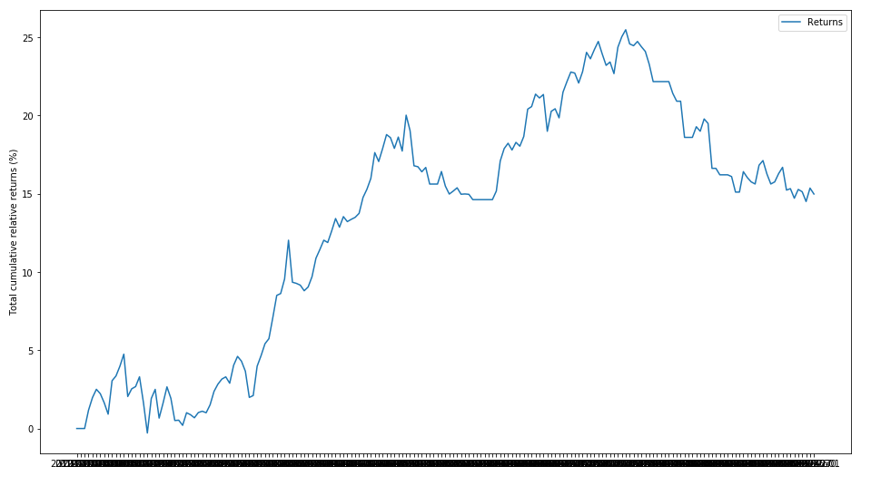

## Simple and Exponential Moving Average Trading Strategy

Here, we look at using past price behaviours to develop a trading strategy. This will include using non-constant weights $w_i(t)$ and adapting them based on recent behaviour of the price of the assets. 

We will use the same 3 assets as we did in the previous sections along with their daily closing price:
```
tickers = ['AAPL', 'AMZN', 'MSFT']
close_data = stock_data['close']
```

One of the oldest and simplest trading strategies that exist is the one that uses a moving average of the price (or returns) timeseries to proxy the recent trend of the price. This helps remove the daily price 'noise' and allows us to observe the longer-term behaviour of the asset. 

Earlier, we created short-term and long-term moving averages for just the AMZN ticker:

```
amzn = close_data.loc[:, 'AMZN']

short_rolling_amzn = amzn.rolling(window=20).mean()
long_rolling_amzn = amzn.rolling(window=100).mean()
```
Plotting this again:

```
# Plot relative and log returns
fig, ax = plt.subplots(figsize=(16,9))
ax.plot(amzn.index, amzn, label='AMZN')
ax.plot(short_rolling_amzn.index, short_rolling_amzn, label='20 days rolling')
ax.plot(long_rolling_amzn.index, long_rolling_amzn, label='100 days rolling')

ax.set_xlabel('Date')
ax.set_ylabel('Adjusted closing price ($)')
ax.set_title('Moving average of some tech stocks')
ax.legend()
plt.show()
```


The Simple Moving Average (SMA) timeseries are less noisy but lag the original price timeseries, which means changes in the trend are only seen with a delay (or lag) of some number of days - let's call this $L$. For a moving average calculated using $M$ days, the lag $L$ is roughly $\frac M 2$. 

So if we are using a 100 days SMA, this means we may be late by almost 50 days, which can significantly affect our strategy.

One way to reduce the lag induced by the use of the SMA is to use the so-called **Exponential Moving Average (EMA)**, defined as:

>$ EMA(t) = (1-\alpha)EMA(t-1) + \alpha p(t)$

with a starting condition:

>$EMA(t_0) = p(t_0)$

where $p(t)$ is the price at time $t$ and $\alpha$ is called the *decay parameter* for the $EMA$. 

$\alpha$ is related to the window $M$ as:

>$ \alpha = \frac 2 {M+1}$

So as $M$ gets larger, $\alpha$ gets smaller. The reason why EMA reduces the lag is that it puts more weight on more recent observations, whereas the SMA weights all observations equally by $\frac 1 M$.

So take $M_1$ = 20 days, $M_2$ = 100 days, $t_0$ = yesterday and $t_1$ = today. 

With $M_1$ = 20 days:

> $EMA(t_1) = 0.905EMA(t_0) + 0.095p(t_1)$


With $M_1$ = 100 days:

> $EMA(t_1) = 0.98EMA(t_0) + 0.02p(t_1)$

The weighting given to the most recent price $p(t_1)$ is greater for a shorter-period EMA ($0.095$) than for a longer-period EMA ($0.02$) and both weightings are higher than what the SMA would have used:

$M_1$ = 20 days:

EMA weighting on $p(t_1)$: $0.095$
SMA weighting on $p(t_1)$: $0.05$

$M_1$ = 100 days:

EMA weighting on $p(t_1)$: $0.02$
SMA weighting on $p(t_1)$: $0.01$

Using Pandas, calculating the exponential moving average is easy. Let's compare the 20 day SMA vs EMA:
```
ema_amzn_short = amzn.ewm(span=20, adjust=False).mean()

# Plot EMA and SMA
fig, ax = plt.subplots(figsize=(16,9))
ax.plot(amzn.index, amzn, label='AMZN Price')
ax.plot(short_rolling_amzn.index, short_rolling_amzn, label='20 days SMA')
ax.plot(ema_amzn_short.index, ema_amzn_short, label='20 days EMA')

ax.set_xlabel('Date')
ax.set_ylabel('Price ($)')
ax.legend()
plt.show()
```


Note the EMA curve smooths out the price fluctuations just like the SMA curve, but is more responsive to price trend changes.

### MA Strategy Implementation

Here, we are going to take advantage of the fact that a moving average timeseries (whether SMA or EMA) lags the actual price behaviour. Our strategy will be to use the crossing of the moving average an actual price timeseries as potential trading signals:

1. When the price timeseries $p(t)$ crosses the EMA timeseries $e(t)$ from below, we will buy (go long) one unit of the asset.

2. When the price timeseries $p(t)$ crosses the EMA timeseries $e(t)$ from above, we will sell one unit of the asset.

Like the last exercise, we will assume our funds are equally split across all 3 assets with a weighting of $w_i(t) = \frac 1 3$ when we are holding the asset and a weighting of $w_i(t) = 0$ when we have sold the asset.

*Advanced - if you are familiar with the concept of short selling, you can use a weighting of $w_i(t) = -\frac 1 3$ in your strategy.*

So to implement the above strategy in Python using Pandas, we simply take the *sign** of the difference between the price $p_i(t)$ and the EMA $e_i(t)$:

```
ema_short = close_data.ewm(span=20, adjust=False).mean()

trading_positions_raw = close_data - ema_short

trading_positions = trading_positions_raw

trading_positions_raw[trading_positions_raw <= 0] = 0

trading_positions = trading_positions_raw.apply(np.sign)*1/3
```
This gives us a `trading_positions` dataframe which looks like:


where $0$ represents days we are not holding the particular stock, and the $0.33..$ representing days we are holding the particular stock. 

Now note that because we are using the **closing stock price** in our analysis, determining whether we are holding a stock or not impacts our action on the **following day**. So our position on $t_0$ is determined by the closing price on day $t_0 - 1$. So this means we need to **lag our trading signals by one day:**

```
trading_positions_final = trading_positions.shift(1)
```
So let us plot the price timeseries and the respective trading position for one of our assets, Amazon:

```
fig, (ax1, ax2) = plt.subplots(2, 1, figsize=(16,9))

ax1.plot(close_data.loc[start_date:end_date, :].index, close_data.loc[start_date:end_date, 'AMZN'], label='Price')
ax1.plot(ema_short.loc[start_date:end_date, :].index, ema_short.loc[start_date:end_date, 'AMZN'], label = 'Span 20-days EMA')

ax1.set_ylabel('$')

ax2.plot(trading_positions_final.loc[start_date:end_date, :].index, trading_positions_final.loc[start_date:end_date, 'AMZN'], label='Trading position')

ax2.set_ylabel('Trading position')
```

And so we get a plot looking something like this:


So we can see how well our 20 day EMA tracks the price as well as when we are holding the stock. 

Now that the position our strategy dictates each day has been calculated the performance of this strategy can be easily estimated. To that end, we will need again the log-returns of the three assets $r_i(t)$ calculated as the difference between the log of the price each day:

```
asset_log_returns = np.log(close_data).diff()
```
Note our strategy assumes each asset is traded separately and is independent of the behaviour of the other assets. However, this might not necessarily be true (e.g. poor earnings news from AMZN might impact other tech stocks like AAPL or MSFT). 

So as before, to get all the strategy log-returns for all days, simply multiply the strategy positions matrix `trading_positions_final` with the `asset_log_returns`:

```
strategy_asset_log_returns = trading_positions_final * asset_log_returns
```
And as before, let us plot the cumulative log-returns and relative-returns of our strategy for each of the 3 assets:

```
# For logs, it is a straight sum
cum_strategy_asset_log_returns = strategy_asset_log_returns.cumsum()

# For relative returns, we use the formulat as before
cum_strategy_asset_relative_returns = np.exp(cum_strategy_asset_log_returns) - 1

# Now we plot
fig, (ax1, ax2) = plt.subplots(2, 1, figsize=(16,9))

for c in asset_log_returns:
    ax1.plot(cum_strategy_asset_log_returns.index, cum_strategy_asset_log_returns[c], label=str(c))

ax1.set_ylabel('Cumulative log-returns')
ax1.legend(loc='best')

for c in asset_log_returns:
    ax2.plot(cum_strategy_asset_relative_returns.index, 100*cum_strategy_asset_relative_returns[c], label=str(c))

ax2.set_ylabel('Total relative returns (%)')
ax2.legend(loc='best')
```
And we get plots which look like:


What is the **total return** of this strategy? We simply sum up the daily returns for each of the 3 assets:

```
cum_relative_return = cum_strategy_asset_relative_returns.sum(axis=1)


fig, ax = plt.subplots(figsize=(16,9))

ax.plot(cum_relative_return.index, 100*cum_relative_return, label='Returns')

ax.set_ylabel('Total cumulative relative returns (%)')
ax.legend(loc='best')
```


And the overall, yearly, performance of our strategy can be calculated again as (this time we write it as a function):

```
def print_portfolio_yearly_statistics(portfolio_cumulative_relative_returns, days_per_year = 52 * 5):

    total_days_in_simulation = portfolio_cumulative_relative_returns.shape[0]
    number_of_years = total_days_in_simulation / days_per_year

    # The last data point will give us the total portfolio return
    total_portfolio_return = portfolio_cumulative_relative_returns[-1]
    # Average portfolio return assuming compunding of returns
    average_yearly_return = (1 + total_portfolio_return)**(1/number_of_years) - 1

    print('Total portfolio return is: ' + '{:5.2f}'.format(100*total_portfolio_return) + '%')
    print('Average yearly return is: ' + '{:5.2f}'.format(100*average_yearly_return) + '%')

print_portfolio_yearly_statistics(cum_relative_return)

>>> Total portfolio return is: 14.99%
    Average yearly return is: 21.18%
```
Recall that the returns from our 'Buy-and-Hold' strategy was:
```
>>> Total portfolio return is: 29.54%
>>> Average yearly return is: 42.77%
```
So our 20 day Moving Average Trading strategy signficantly underperforms the buy-and-hold for **this specific set of assets** over our **specific period of time**. 

Your turn to explore:

*  How do the 2 strategies compare at different points in time if you were to go back say 2 years? 5 years? 10 years?

* How does a longer term Moving Average Trading strategy (e.g. 100 or 200 days) compare with the 20 day strategy?

* What if we diversify our portfolio of assets and use stocks from different industries? What do our returns look like then?